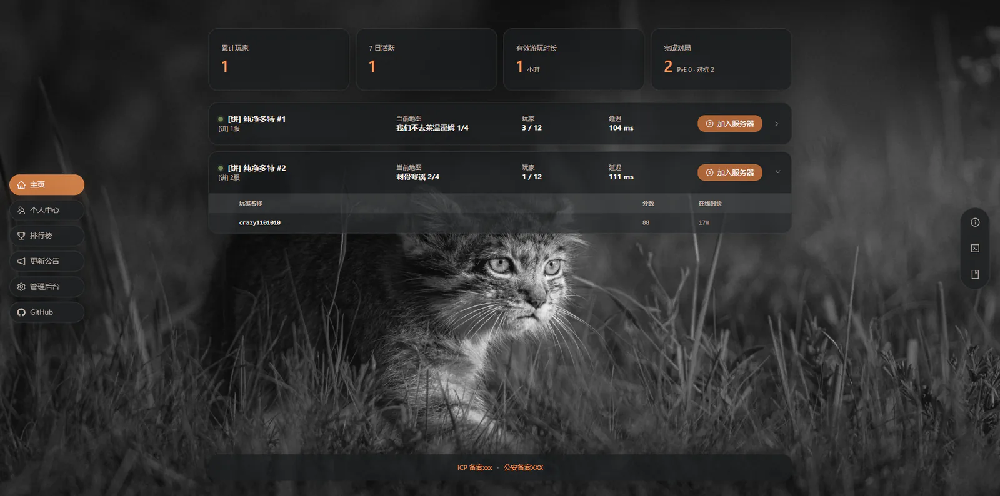
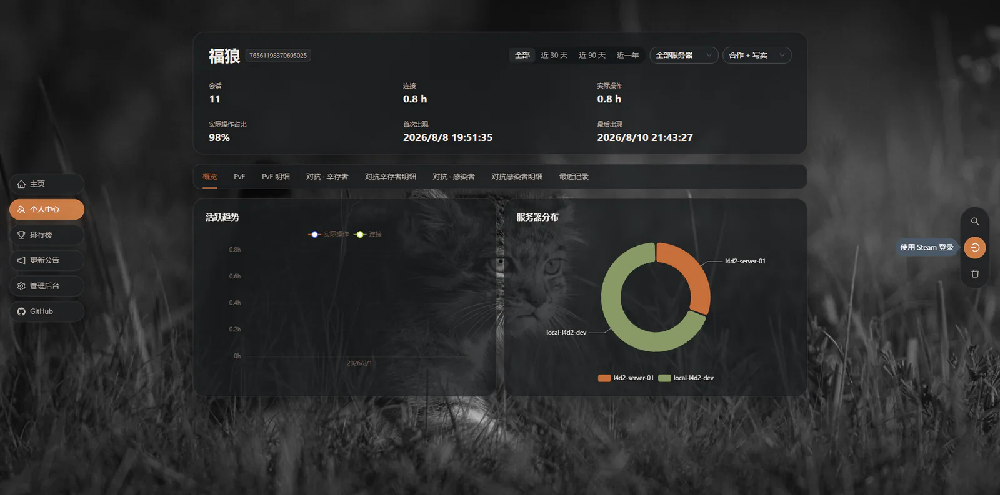
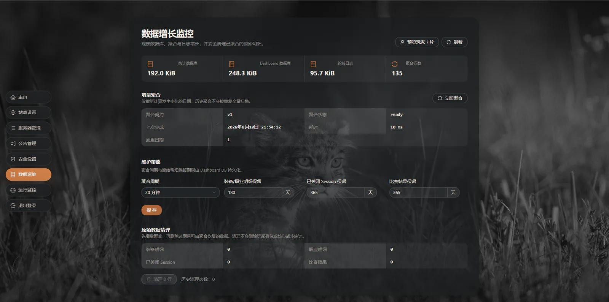
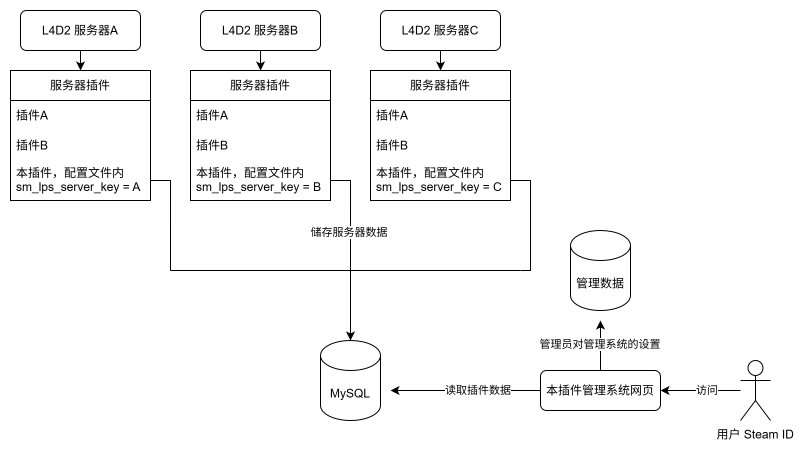

# L4D2 Player Stats

[](https://github.com/gofurry/l4d2-plugin-stats/actions/workflows/go.yml)
[](https://github.com/gofurry/l4d2-plugin-stats/actions/workflows/frontend.yml)
[](LICENSE)

面向《求生之路 2》服务器的玩家统计系统，由 SourceMod 数据采集插件和可选的 Web Dashboard 组成。采集器记录真人玩家在合作、写实和对抗模式中的身份、会话、玩法数据与低频战局事实；Dashboard 提供服务器状态、个人中心、排行榜、战局分析、更新公告和数据维护后台。

> 第一次部署请阅读[中文部署手册](INSTALL.zh-CN.md)；升级已有安装请阅读[升级与回滚](UPGRADE.zh-CN.md)。

## 功能

- 只统计通过 Steam 验证的真人玩家，不为 Bot 创建玩家档案；
- 合作与写实共用 PvE 统计口径，对抗模式使用独立的幸存者、感染者、半场和比赛模型；
- 记录连接时间、实际操作时间、章节与战役成绩、击杀、伤害、生存、救援、治疗、装备和技巧数据；
- 保存每个 Round 的规则环境，并以可验证、低频的 Incident 分析控制、倒地、死亡、救援、警报车和 Boss 生命周期；
- 支持 SQLite、MySQL 和 PostgreSQL，三种数据库使用一致的结构与统计契约；
- 通过绝对快照、异步保存、有界队列、重试和日志抑制降低数据库故障对游戏线程的影响；
- 提供内嵌 React 的 Go 单二进制 Dashboard，无需单独部署前端；
- 支持 Steam OpenID、手动 SteamID64 查询、全服排行榜、多服务器 A2S 状态和单管理员后台；
- 提供地图/战役、规则环境、标准化时间线、Boss 生存时间和玩家效率分析；
- 提供日、月度和终身聚合、数据库增长监控及管理员确认后的分批清理；
- 应用日志自动轮转，公开 API 不返回玩家 IP，管理写操作使用 JWT、CSRF 和请求限流保护。

## 界面预览

### 服务器概览



### 玩家个人页



### 数据运维



## 运行结构



每台 L4D2 服务器运行一份采集器并使用唯一的 `server_key`；多台服务器可以写入同一个 Stats 数据库，由 Go Dashboard 统一只读查询和聚合。采集插件可以独立运行；只有需要网页展示和数据维护时才部署 Dashboard。

## 支持范围

| 项目 | 支持内容 |
|---|---|
| 游戏模式 | `coop`、`realism`、`versus` |
| Stats 数据库 | SQLite、MySQL、PostgreSQL |
| Dashboard 系统 | Windows amd64、Linux amd64 |
| 玩家身份 | SteamID64 真人玩家 |
| 服务器形态 | 独立服务器、用于开发测试的本地服务器 |

其他游戏模式不会创建身份、会话或统计记录。PvE 与对抗数据严格分开，详细统计语义见[统计口径](contracts/statistics.md)和[对抗契约](contracts/versus-v1.md)。

## Release 包结构

官方构建产物同时包含采集器和 Dashboard：

```text
l4d2-plugin-stats-*.zip
├─ left4dead2/                         直接合并到游戏服务端目录
│  └─ addons/sourcemod/
│     ├─ plugins/l4d2_player_stats.smx
│     └─ configs/l4d2_player_stats/migrations/
├─ dashboard/
│  ├─ windows-amd64/
│  │  ├─ l4d2-stats.exe
│  │  └─ config.example.yaml
│  └─ linux-amd64/
│     ├─ l4d2-stats
│     └─ config.example.yaml
├─ examples/
│  ├─ databases.cfg.example
│  ├─ dashboard-sqlite.yaml
│  ├─ dashboard-mysql.yaml
│  ├─ dashboard-postgresql.yaml
│  └─ nginx.conf.example
├─ INSTALL.zh-CN.md
├─ UPGRADE.zh-CN.md
├─ CHANGELOG.md
├─ README.md
└─ LICENSE
```

Dashboard 前端已嵌入可执行文件，不需要单独部署 Node.js。发布包不包含开发期的 `docs/` 和 `contracts/` 目录；部署所需内容集中在两份离线手册和 `examples/`。Linux 解压后如缺少执行权限，请运行 `chmod +x dashboard/linux-amd64/l4d2-stats`。

## 快速开始

### 1. 安装采集器

服务器需要先安装 [Metamod:Source](https://www.sourcemm.net/) 和 [SourceMod](https://www.sourcemod.net/)。

将 release 压缩包内的 `left4dead2` 文件夹覆盖到服务器同名目录。它会安装：

```text
left4dead2/addons/sourcemod/plugins/l4d2_player_stats.smx
left4dead2/addons/sourcemod/configs/l4d2_player_stats/migrations/
```

将 `examples/databases.cfg.example` 中选定的数据库块合并到：

```text
left4dead2/addons/sourcemod/configs/databases.cfg
```

插件首次加载会生成：

```text
left4dead2/cfg/sourcemod/l4d2_player_stats.cfg
```

至少设置一个在共享数据库中唯一的服务器标识：

```text
sm_lps_server_key "my-l4d2-server-01"
```

重新加载并检查状态：

```text
sm plugins reload l4d2_player_stats
sm_lps_status
```

正常状态应显示数据库驱动、`schema=5/5` 和 `state=ready`。完整步骤见[中文部署手册](INSTALL.zh-CN.md)。

### 2. 启动 Dashboard

从压缩包的 `dashboard` 目录选择对应平台的二进制，并将 `config.example.yaml` 复制为 `config.yaml`：

```yaml
server:
  listen: "0.0.0.0:18848"

dashboard_database:
  path: "./dashboard.db"

stats_database:
  driver: "sqlite"
  dsn: "/absolute/path/l4d2_player_stats.sq3"

logging:
  file: "./logs/l4d2-stats.log"

monitor:
  enabled: true
```

启动服务：

```sh
./l4d2-stats serve --config ./config.yaml
```

首次启动会在终端输出一次性设置令牌。打开 `/admin/setup` 创建管理员，然后在后台配置界面、服务器、Steam 登录、公告和数据维护策略。

Linux 可直接注册为 systemd 服务：

```sh
sudo ./l4d2-stats install --config ./config.yaml
```

生产部署、HTTPS、权限和首次设置说明见[中文部署手册](INSTALL.zh-CN.md)，备份与回滚说明见[升级与回滚](UPGRADE.zh-CN.md)。

## 管理命令

| 命令 | 权限 | 用途 |
|---|---|---|
| `sm_lps_status` | SourceMod root | 查看连接、驱动、迁移和最近错误 |
| `sm_lps_reconnect` | SourceMod root | 立即重新连接并检查数据库 |
| `sm_lps_flush` | SourceMod root | 立即保存当前快照 |

Dashboard CLI 提供：

```text
l4d2-stats serve
l4d2-stats doctor
l4d2-stats doctor --deep
l4d2-stats aggregate status
l4d2-stats aggregate rebuild
l4d2-stats backup create
l4d2-stats backup restore <file>
l4d2-stats diagnostics export
l4d2-stats migrate status
l4d2-stats install
l4d2-stats uninstall
```

所有命令都可通过 `--config` 指定配置文件。

## 数据与隐私

- Stats DB 是游戏采集事实来源，Dashboard DB 保存网页配置、管理员和可重建的聚合数据；
- 采集器保存服务器观察到的玩家 IP，用于会话审计，但公开 API 和网页不会查询或展示该字段；
- 常规 Dashboard 查询只读 Stats DB；执行原始数据清理时才使用具备 `DELETE` 权限的维护连接；
- 过期装备/职业明细、已关闭 Session 和比赛结果只有在聚合覆盖校验通过并由管理员确认后才会分批删除；Incident 使用独立的默认 180 天保留策略；
- 数据库密码只应保存在服务器本地配置中，不应提交到仓库。

详细规则见[数据生命周期](docs/dashboard-data-lifecycle.md)。

## 从源码构建

采集器以生产环境稳定版 SourceMod 1.12 为兼容目标，需要 SourcePawn Compiler `1.12.0.7246`、对应版本的 include、Python 3 和本机路径配置。编译工具目录应与游戏服务器的 SourceMod 运行目录分开配置，构建脚本会拒绝 1.13 或其他版本的编译器：

```powershell
Copy-Item scripts/config.example.ps1 scripts/config.local.ps1
./scripts/build.ps1
```

Dashboard 构建需要 Go、Node.js 和 pnpm：

```powershell
./scripts/build-dashboard.ps1
```

Linux 可以使用：

```sh
./scripts/build-dashboard.sh
```

项目构建产物统一写入 `dist/`，不会被 Git 跟踪。

## 仓库结构

```text
collector/     SourceMod 采集器源码
database/      SQLite、MySQL、PostgreSQL 迁移与结构说明
contracts/     模式、统计口径和对抗数据契约
dashboard/     Go API、Dashboard DB、内嵌 React 前端
docs/          部署、数据生命周期和维护文档
scripts/       构建、校验、部署和打包脚本
```

## 参与贡献

欢迎提交 Issue 或 Pull Request。涉及数据库字段、统计含义或玩法边界的修改，请先阅读现有契约，并同步更新三种数据库迁移、采集器和 Dashboard 查询。实现已有 Issue 的功能 PR 请在描述中使用 `Fixes #<issue-number>`，让功能合并时同步关闭对应 Issue。

## License

[MIT](LICENSE)
